# Git 基础

## 初始化一个新的仓库  
>`$ mkdir myproject`  
>`$ cd ./myproject`  
>`$ git init`

## 克隆已有仓库helloworld  
>`$ git clone https://gitee.com/pending_bit/helloworld`  

## 克隆已有仓库helloworld并重命名为myworld  
>`$ git clone https://gitee.com/pending_bit/helloworld myworld`  

## 文件状态  
git管理的文件分为`tracked`和`untracked`两类，也就是被追溯和未被追溯两种区分。  

`tracked`被追溯文件会有三种状态：  
|——`unmodified` 代表文件与上次提交保持一致  
|——`modified`   代表文件与上次提交不一致  
|——`Staged`     代表文件已经修改且被暂存

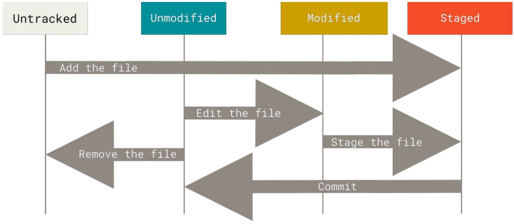

## 查看文件状态
>$ git status  
>$ git status -s //精简显示 -s：short

## 暂存已修改文件或者新的文件
>$ git add file-modifed file-new  

## 配置ignore文件
创建名为`.gitignore`的文件用来忽略不想加入管控的文件  
>$cat .gitignore  
>`#`忽略所有.o 和.a 结尾的文件  
>*.[oa]  
>
>`#`追溯特定lib.a文件，即使之前设定忽略所有.a  
>!lib.a  
>   
>`#`忽略所有~结尾的文件  
>*.~  
>  
>`#`仅忽略当前目录下的todo文件，非子目录下的todo文件  
>/todo  
>
> `#`忽略build目录下的所有文件，包含所有子目录  
> bulid/  
>
> `#`仅忽略doc目录下所有.txt文件，非子目录下的.txt文件  
> doc/*.txt  
>
> `#`忽略doc目录下所有.pdf文件，包含所有子目录  
> doc/**/*.pdf  
>

## 查看代码差异
>$ git diff   #查看工作区与暂存区的文件差异  
>$ git diff --staged  #查看暂存区与上一次提交记录的文件差异  
>$ git diff HEAD^ HEAD #查看上次提交记录与其前一次提交记录的差异  
>$ git diff commit-ID1 commit-ID2 #查看提交记录1到提交记录2的差异  

`TIP:`   
1.HEAD代表最新一次提交记录，即上一次提交记录  
2.HEAD^代表倒数第二次提交记录，即上上次计较记录  
3.git diff --staged 与 git diff --cached 作用相同  
4.commit-ID通过git log查看提交记录获得，本质是一串哈希值

## 提交修改
>$ git commit -m "commit log" #提交暂存区的文件，生成新的提交记录  
>$ git commit -a -m "commit log" #add与commit步骤合并为一步

## 删除文件
>$ git rm file #删除file文件并停止追溯，相当于`rm file | git add file`  
>$ git rm --cached file #保留file文件并停止追溯，用于本来ignore的文件被不小心提交了  
>
>$ git rm log/\*.log #删除log目录下所有.log文件并停止追溯  
>$ git rm \*~ #删除所有~结尾的文件并停止追溯  
>#通配符星号前面的反斜杠是必须的，遵循git要求

## 重命名文件
>$ git mv file_from file_to #重命名file_from为file_to,相当于`rm file_from file_to | git rm file_from | git add file_to`  

## 查看提交记录
>$ git log #查看所有提交记录  
>$ git log branchname #查看指定分支的log  
>$ git log -2 #查看最近两次提交记录  
>$ git log -p #查看所有提交记录，并显示详细diff  
>$ git log -p -2 #查看最近2次提交记录，并显示详细diff  
>$ git log --stat #查看所有提交记录，并简要显示文件修改数量  
>$ git log -- files #查看所有和files相关的提交记录  
>$ git log -S function_name #查看所有代码中和`function_name`字符串相关的提交记录  
>$ git log --grep string #查看所有提交日志中包含`string`的提交记录  
>$ git log --pretty=oneline #查看所有提交记录，每条记录用一行简要显示  
>$ git log --pretty=short #查看所有提交记录，`short`模式显示  
>$ git log --pretty=full  #查看所有提交记录，`full`模式显示  
>$ git log --pretty=fuller  #查看所有提交记录，`fuller`模式显示  
>$ git log --pretty= oneline --graph #ascii码图像化commit过程  
>$ git log --pretty=format:"%h -%an ，$ar : %s"  #按照{缩略哈希值-作者名字，作者相对时间：日志log}格式输出log    

--pretty=format支持的百分符号如下：
|百分符号|描述|
|-----|-----|
|%H|哈希值|
|%h|简要哈希值|
|%T|树哈希值|
|%t|简要树哈希值|
|%P|父哈希值|
|%p|简要父哈希值|
|%an|作者名字|
|%ae|作者邮箱|
|%ad|作者日期|
|%ar|作者相对日期|
|%cn|提交者名字|
|%ce|提交者邮箱|
|%cd|提交者日期|
|%cr|提交者相对日期|
|%s|日志log|

## 撤回
>$ git commit --amend  #对上一次提交进行修正， 一般用来修正忘记添加的文件，或者修改上次提交的日志内容  
>$ git restore --staged file  #撤销之前add操作的file文件  
>$ git restore file  #撤销工作区的任何修改  

## 远程仓库
远程仓库是用于和其他协作者分享你的工作，相当于是多方维护的一个共享仓库。

### 查看远程仓库
>$ git remote #显示远程仓库的shortname， clone后远程仓库默认为`origin`  
>$ git remote -v #显示远程仓库的shortname以及完整URL信息  

### 增加远程仓库
>$ git remote add pb `https://github.com/pendingbit/helloworld`

### 从远程仓库获取数据
>$ git fetch <remote>
>$ git pull <remote>

### 推送数据到远程仓库
>$ git push <remote> <branch>

### 检阅一个远程仓库
>$ git remote show <remote>

### 重命名远程仓库
>$ git remote rename oldname newname

### 删除远程仓库
>$ git remote remove name

## TAG
### 查看tag
>$ git tag  #查看所有打上tag软件版本  
>$ git tag -l "v1.8.5* #查看所有匹配v1.8.5开头的tag  
>$ git show v1.4 #查看某一个具体的tag信息

### 创建tag
>$ git tag -a v1.4 -m "my version 1.4"  #annotated tag   
>$ git tag v1.4-lw #lightweight tag  
>$ git tag -a v1.2 9fce02 #对之前的某一次提交打tag  

### 分享tag
>$ git push origin `tagname` #推送某一个tag  
>$ git push --tags #推送所有tag  

### 删除tag
>$ `git tag -d v1.4-lw`

### checkout tag
>$ git checkout v1.4-lw #注意此时detached HEAD 状态 ， 在此基础上修改无法提交  

## 重命名
>$ git config --global alias.co checkout  
>$ git config --global alias.br branch  
>$ git config --global alias.ci commit  
>$ git config --global alias.st status
>$ git config --global alias.unstage 'reset HEAD --'  
>$ git config --global alias.last 'log -1 HEAD'  

# GIT Branch
## 创建分支
当前状态
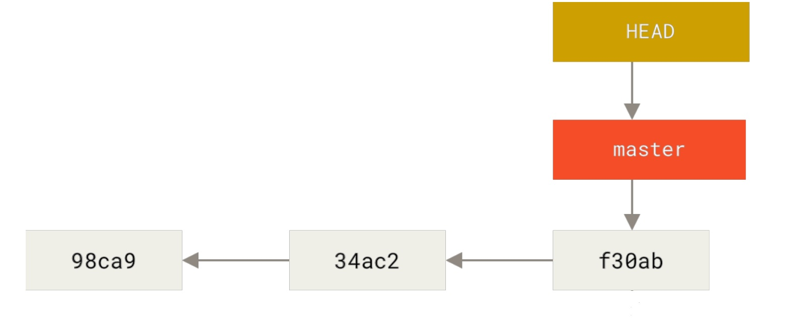
>$ `git branch testing` #创建testing分支  
> 新创建的分支本质就是创建了新命名的指针指向当前commit；HEAD是个特殊指针，永远指向当前所处的commit

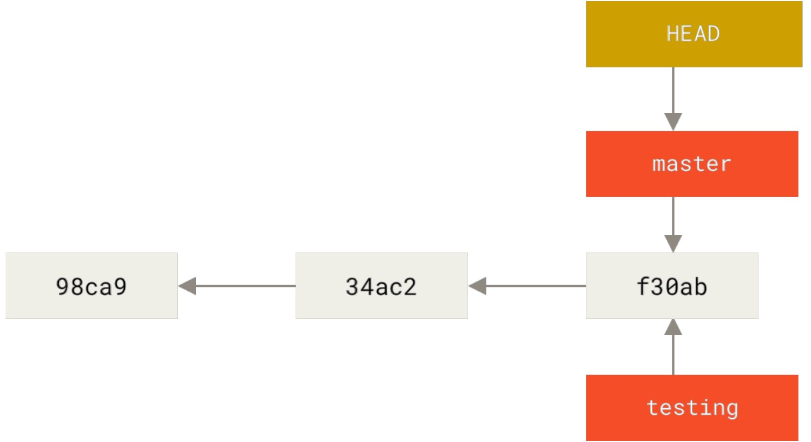

## 切换分支
>$ `git checkout testing` #切换到testing分支;HEAD指向testing;并且工作区所有内容会重置为分支版本;`切换分支前clean working state`  
>$ `git switch testing` #同上  
>$ `git checkout -b newbranchname` #创建并切换到新的分支  
>$ `git switch -c newbranchname`  #同上  
>$ `git switch -` #切换回上一个分支

创建testing分支
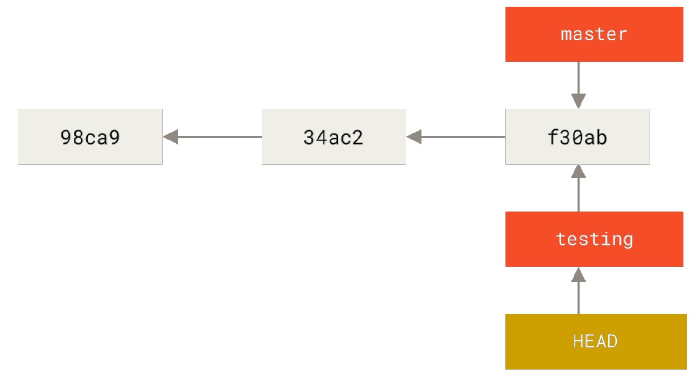
在不同的分支上进行各自开发和commit  
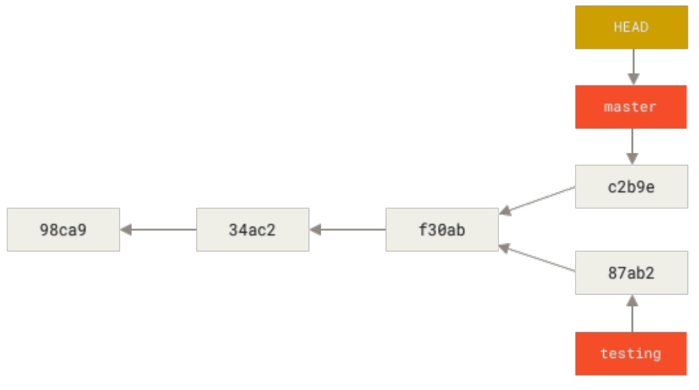

## branching and Merging

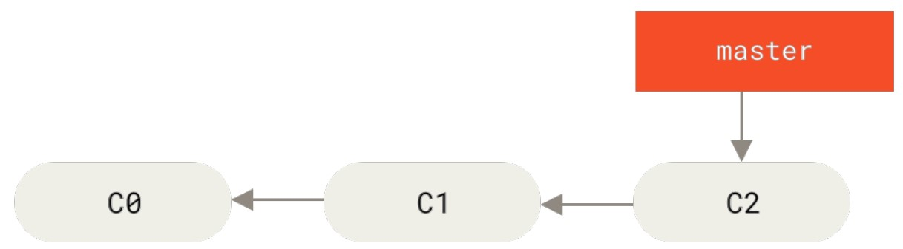
一个简单的commit，c0->c1->c2  
此时需要开发#53号特性，创建`iss53`分支
>$ `git checkout -b iss53`   
>$ `git branch iss53 | git checkout iss53` #功能同上  
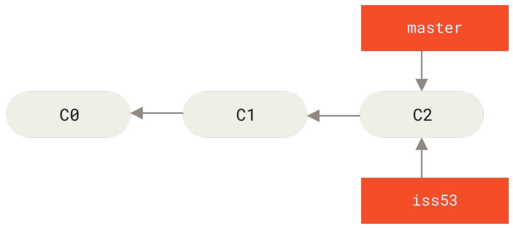  

在iss53分支上进行了提交
>$ ***do some job***  
>$ `git commit -a -m "new function in [issue 53]"`  
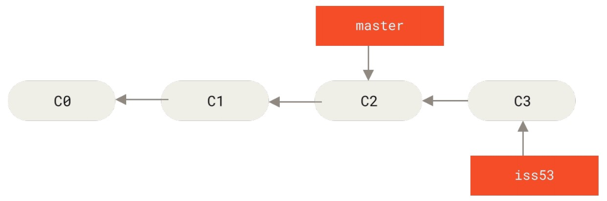  

在master分支c2版本发现了一个bug，创建hotfix分支来解决  
>$ `git checkout master`  
>$ `git checkout -b hotfix`  
>$ ***do some fix***  
>$ `git commit -a -m "fix bug"`  
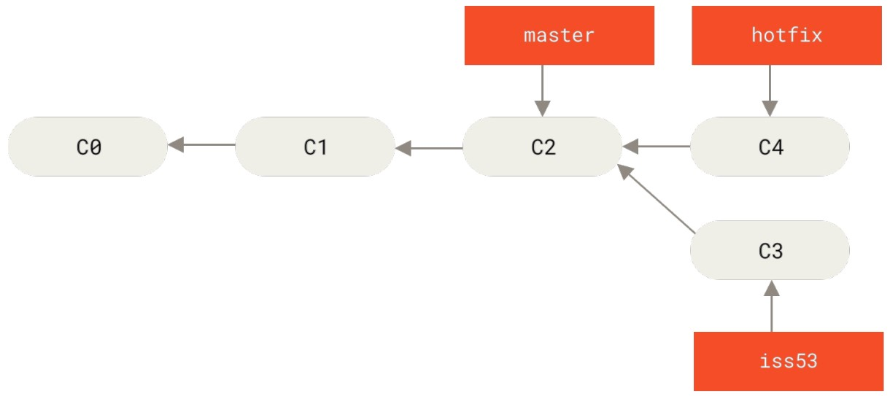  

bug修复完毕，需要合并到master分支去
>$ `git checkout master`  
>$ `git merge hotfix`  #快速前进合并fast-forward  
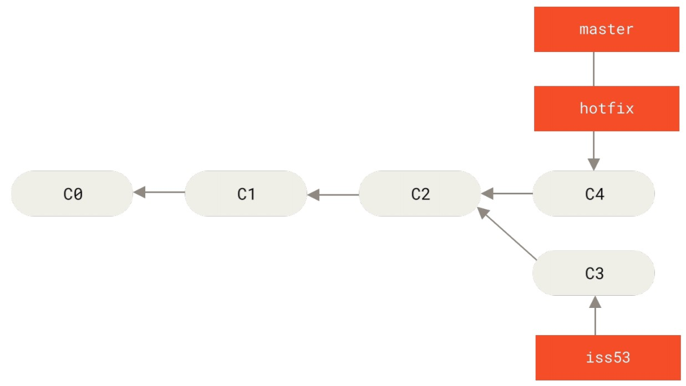  

hotfix分支已经无意义，将其删除,切换到iss53分支继续工作 
>$ `git branch -d hotfix`  
>$ `git checkout iss53`  
>$ ***do some job***  
>$ `git commit -a -m "finish function [issue53]"`  
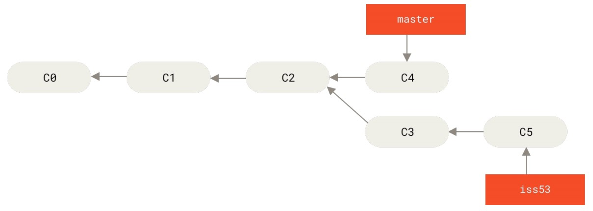  

iss53分支工作完成，合并到master分支并删除iss53分支     
>$ `git checkout master`  
>$ `git merge iss53`  #没有冲突的情况下，git merge自动创建合并commit  
>$ `git branch -d iss53`
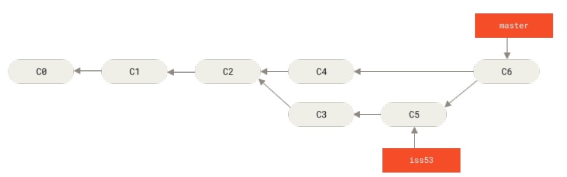  

通过三个快照进行合并，`master iss53` 以及他们的公共祖先快照`c2`  
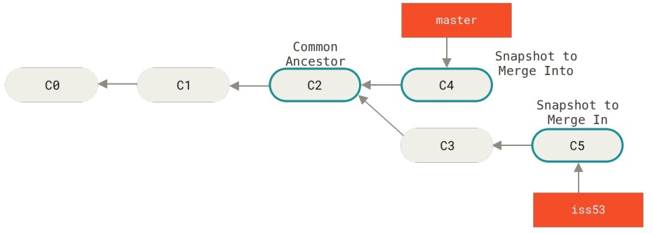

## 合并冲突基础
如果iss53分支和hotfix分支都修改某个文件的同一部分，那么将出现合并冲突问题
>$ `git merge iss53`  
>Auto-merging test.c  
>CONFILCT(content):Merge conflict in test.c  
>Automatic merge failed; fix conflicts and then commit the result.  

使用git status查看冲突的文件  
>$ `git status`  
>On branch master  
>You have unmerged paths.  
>  (fix conflicts and run "git commit")  
>Unmerged paths:  
>  (use "git add <file>..." to mark resolution)  
>  both modified: index.html  
>no changes added to commit (use "git add" and/or "git commit -a")  

git将自动添加两个版本内容到冲突文件中，格式如下
>`<<<<<<< HEAD:test.c`  
> abcdefg  = 1;  
>`=======`  
> abcdeft = 2;  
>`>>>>>>> iss53:index.html`  

使用编辑工具进行修改，其中`<<<<<<< HEAD:test.c` , `=======` , `>>>>>>> iss53:index.html`都是辅助表示，需要删除。

修改完毕后，通过add/commit 操作完成此次合并。

