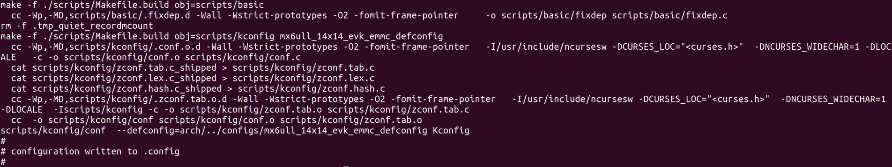
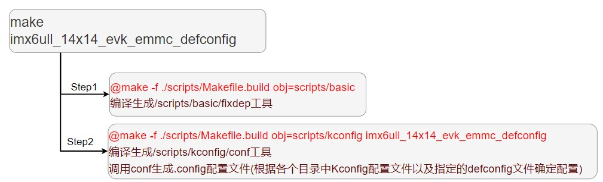

# 常用命令
## help帮助信息
>=>`help`  //查看所有支持的命令  
>=>`help cmd` //查看**cmd**命令提示信息  
>=>`?` //作用等同于**help**  

## bdinfo查看板子信息  

## print查看环境变量  

## version查看版本信息  

## setenv设置环境变量  
>=>`setenv bootdelay 5` //修改**bootdelay = 5**  
>=>`setenv bootargs 'console=ttymxc0,115200 root=/dev/mmcblk1p2 rootwait rw'` //包含空格的变量值需要用单引号括起来   
>=>`setenv myEnv joey` //新建环境变量**myEnv = joey**  
>=>`setenv myEnv` //删除环境变量**myEnv**  

## saveenv保存环境变量  

## md显示内存 md[.b,.w,.l] address count 
>=>`md.b 80000000 40` //打印0x80000000开始的0x40个**byte**的内存值  
>=>`md.w 80000000 20` //打印0x80000000开始的0x20个**world**的内存值  
>=>`md.l 80000000 10` //打印0x80000000开始的0x10个**long**的内存值  

## nm修改指定内存 nm[.b,.w,.l] address   
>=>`nm.l 80000000` //修改0x80000000地址内存值为**0x1234567**      
>80000000: 0500e031 ? `12345678`  
>80000000: 12345678 ? `q`  
>=>

## mm连续修改内存 mm[.b,.w,.l] address  
>=>`mm.l 80000000`  //修改0x80000000开始的内存值  
>80000000：12345678 ？`05050505`  
>80000004: 15d723ac ? `05050505`  
>80000008: 2b008806 ? `05050505`  
>8000000c: ae78903f ? `q`  
>=>

## mw指定内存写入指定数据 mw[.b,.w,.l] address value count  
>=>`mw.b 80000000 0a 10` //从0x80000000开始写入**0x10**个**0x0a**    

## cp复制内存 cp[.b,.w,.l] source target count   
>=>`cp.b 80000000 80000100 10` //从0x80000000拷贝**0x10**个**byte**到0x80000100  

## cmp比较内存 cmp[.b,.w,.l] addr1 addr2 count  
>=>`cmp.b 80000000 80000100 10` /比较0x80000000和0x80000100的**0x10**个**byte**  

## ping网络连通测试  
>=>`ping 192.168.1.253` //测试连通 192.168.1.253  

## dhcp动态分配IP  

## nfs网络文件系统 nfs [loadAddress] [[hostIPaddr:]path/filename]   
>=>`nfs 80800000 192.168.1.153:/home/joey/linux/nfs/zImage` //将 192.168.1.153主机的**zImage**文件下载到0x80800000地址内存中

## tftp网络传输 tftp [loadAddress] [[hostIPaddr:]filename]  
>=>`tftp 80800000 zImage` //从serverIP下载zImage文件到0x80800000  

## mmc命令  
>=>`mmc info` //输出当前选中的mmc设备信息  
>=>`mmc list` //列举所有mmc设备  
>=>`mmc dev [dev] [part]` //切换当前mmc设备  
>=>`mmc dev 0 0` //切换到mmc设备0的分区0  
>=>`mmc part` //查看mmc设备分区情况  
>=>`mmc erase [startBloc] [count]` //擦除指定数据块  
>=>`mmc read [loadAddress] [startBlock] [count]` //读取mmc数据块到内存中  
>=>`mmc read 80800000 600 10` //从mmc设备第**0x600**个块开始读取**0x10**个块到0x80800000地址  
>=>`mmc write [Address] [startBlock] [count]`  //将内存中数据写入mmc设备中  

>=>`tftp 80800000 u-boot.imx`   
>=>`mmc dev 0 0`  
>=>`mmc wirte 80800000 2 32e` //网络下载uboot并更新  

>=>`tftp 80800000 u-boot.imx`  
>=>`mmc dev 1 0`   
>=>`mmc write 80800000 2 32e`  
>=>`mmc partconf 1 1 0 0`  //更新emmc中uboot需要分区配置一下  

>=============  
***千万不要修改SD卡或者EMMC前两块扇区，里面保存着分区表***  
=============
>=

## fat格式文件系统操作命令  
>=>`fatinfo [interface] [dev:[part]]` //查询指定设备分区的fat文件系统信息  
>=>`fatinfo mmc 1:1` //查询mmc设备1分区0的fat文件系统信息  
>=>`fatls [interface] [dev:[part]] [directory]` //查询fat格式设备的目录和文件信息  
>=>`fatls mmc 1:1 /` //查询mmc设备1的分区1根目录中的所有文件和目录  
>=>`fstype [interface] [dev]:[part]` //查询某个人去的文件系统格式  
>=>`fstype mmc 1:1`  //查询mmc设备1分区1的文件系统格式  
>=>`fatload [interface] [dev]:[part] [loadAddress] [path/filename]`  //读取指定文件到ram中  
>=>`fatload mmc 1:1 80800000 /zImage` //读取zImage文件到0x80800000地址  
>=>`fatwrite [interface] [dev]:[part] [Address] [path/filename] [bytes]` //将指定内存数据写入fat文件系统中  
>=>`fatwrite mmc 1:1 80800000 /zImage 6788f8`  //写入**zImage**文件，注意文件大小必须按照实际大小

## ext格式文件系统操作命令  
>=>`ext4ls ext4load ext4write 同fatls fatload fatwirte` 

## fdt设备树相关命令  
>=>`fatls mmc 1:1 83000000 /imx6ul.dtb`  //复制设备树到内存中  
>=>`fdt addr 83000000`  //设置设备树起始地址  
>=>`fdt header`  //显示设备树头信息  
>=>`fdt print`  //打印设备树详细内容  

## boot相关命令  
>=>`tftp 80800000 zImage`  
>=>`tftp 83000000 imx6ul.dtb`  
>=>`bootz 80800000 - 83000000`  //通过**tftp**下载zImage和dtb，通过**bootz**命令启动内核  

>=>`fatload mmc 1:1 80800000 zImage`  
>=>`fatload mmc 1:1 83000000 imx6ul.dtb`  
>=>`bootz 80800000 - 83000000` //通过**fatload**载入zImage和dtb，通过**bootz**命令启动内核  

>=>`setenv bootcmd tftp 80800000 zImage; tftp 83000000 imx6ul.dtb; bootz 80800000 - 83000000'`  
>=>`saveenv`  
>=>`boot`  //执行**bootcmd**环境变量的启动命令  

## reset复位  

## go [Address] 执行指定地址指令  

## run命令运行环境变量定义的命令  
>=>`setenv bootemmc 'fatload mmc 1:1 80800000 zImage; fatload mmc 1:1 83000000 imx6ul.dtb; bootz 80800000 - 83000000'`  
>=>`setenv bootnet 'tftp 80800000 zImage; tftp 83000000 imx6ul.dtb; bootz 80800000 - 83000000'`  
>=>`saveenv`  
>=>`run bootemmc` //执行bootemmc中的启动指令  
>=>`run bootnet` //执行bootnet中的启动指令  

# uboot编译命令  
## make imx6ull_14x14_evk_emmc_defconfig  
  
  

## make all  
